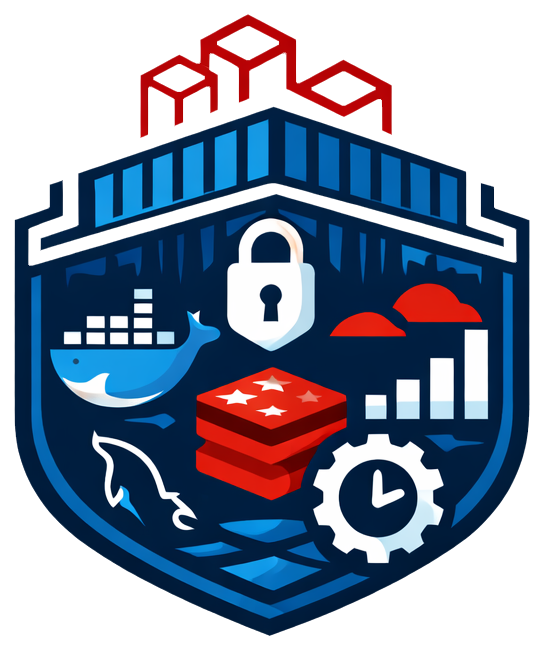

# 🚀 Laravel Docker Production Stack

<div align="center">
  
  <br />
  <br />
</div>

**Production-ready Docker environment for Laravel 12+ with automated deployment, SSL management, and Cloudflare detection.**

[](https://laravel.com)
[](https://php.net)
[](https://docker.com)
[](LICENSE)
[](https://github.com/mg2k4/Dockavel/stargazers)
[](https://github.com/mg2k4/Dockavel/releases)
[](https://github.com/mg2k4/Dockavel/issues)
[](https://github.com/mg2k4/Dockavel/pulls)

[](https://www.youtube.com/watch?v=o-kj-T2QlXw)

*Click the image above to watch the installation demo*

---

## 📋 Table of Contents

- [Why This Stack?](#-why-this-stack)
- [Features](#-features)
- [Quick Start](#-quick-start)
- [Documentation](#-documentation)
- [Requirements](#-requirements)
- [Common Commands](#-common-commands)
- [Contributing](#-contributing)

---

## 🎯 Why This Stack?

This stack started as a personal setup that evolved over several years of Laravel deployments. It tries to address common pain points and provide sensible defaults out of the box.

**What it offers:**

- **Zero-config deployment** — One command deploys dev or production
- **Security defaults** — SSH hardening, Fail2Ban, UFW firewall, automated updates
- **SSL automation** — Let's Encrypt with auto-renewal via Certbot
- **Smart Cloudflare detection** — Automatically adapts to proxy/DNS-only mode
- **Production optimizations** — OPcache, Redis caching, optimized PHP-FPM
- **Real-time features** — Horizon for queues, supervisor for workers
- **Developer experience** — Hot reload with Vite, interactive scripts

If it can save you some setup time, that's great. Feel free to adapt it to your needs.

---

## ✨ Features

### 🔧 Core Stack
- **Laravel 12+** with PHP 8.4+
- **Nginx** with optimized configuration & security headers
- **MySQL 8.0** with custom tuning
- **Redis 7** for cache/sessions/queues
- **Horizon** for queue management
- **Supervisor** for background workers
- **Certbot** for SSL certificate management

### 🚀 Automation Scripts
- `deploy.sh` — Interactive deployment (dev/prod)
- `server-setup.sh` — One-time server initialization
- `update.sh` — Update after git pull
- `backup.sh` — Database backups
- `laravel-helper.sh` — Quick Laravel commands
- `create-ssl-certs.sh` — Dev SSL certificates

### 🔒 Security
- SSH hardening (key-only auth, root disabled)
- Fail2Ban protection (automatic IP banning)
- UFW firewall (ports 22, 80, 443)
- Automated security updates
- Nginx rate limiting & security headers
- Sensitive file protection (.env, .git)

### 🌐 Production Ready
- Cloudflare detection (proxy vs DNS-only)
- Health checks on all services
- Resource limits (CPU/memory)
- Zero-downtime deployments
- Comprehensive logging
- Graceful shutdowns

---

## ⚡ Quick Start

### 1️⃣ First-Time Server Setup

Run this **once** on a fresh Ubuntu server (as root):

```bash
curl -fsSL https://raw.githubusercontent.com/mg2k4/Dockavel/main/scripts/server-setup.sh -o server-setup.sh
chmod +x server-setup.sh
sudo ./server-setup.sh
```

This configures Docker, firewall, Fail2Ban, deploy user, and security hardening.

**⏱️ Duration:** ~2 minutes

---

### 2️⃣ Deploy Application

SSH into your server as the `deploy` user:

```bash
ssh deploy@your-server-ip
cd /var/www
git clone git@github.com:mg2k4/Dockavel.git app
cd app
chmod +x ./scripts/*.sh
```

**Development:**
```bash
./scripts/deploy.sh dev
```

**Production:**
```bash
./scripts/deploy.sh prod
```

The script handles everything: environment setup, Docker build, dependencies, SSL, migrations, and optimization.

**⏱️ Duration:** ~3-5 minutes (first deploy)

---

### 3️⃣ Access Your Application

**Development:**
```
http://localhost          (HTTP)
https://localhost         (HTTPS, self-signed)
http://localhost:5173     (Vite HMR)
```

**Production:**
```
https://your-domain.com   (with Let's Encrypt SSL)
```

---

## 🏗️ Architecture

### Docker Services

| Service | Purpose | Exposed Ports |
|---------|---------|---------------|
| `app` | PHP-FPM + Laravel application | - |
| `webserver` | Nginx reverse proxy | 80, 443 |
| `db` | MySQL 8.0 database | 3306 (dev) |
| `caching` | Redis for cache/session/queue | 6379 (dev) |
| `supervisor` | Horizon + background workers | - |
| `scheduler` | Laravel task scheduler (cron) | - |
| `certbot` | SSL certificate management | - |

See [Docker Architecture](docs/DOCKER.md) for detailed service configurations.

---

## 📚 Documentation

### Core Documentation
- **[Installation Guide](docs/INSTALLATION.md)** — Detailed setup instructions
- **[Scripts Reference](docs/SCRIPTS.md)** — All automation scripts explained
- **[Docker Architecture](docs/DOCKER.md)** — Deep dive into containers
- **[Troubleshooting](docs/TROUBLESHOOTING.md)** — Common issues and solutions
- **[Contributing](docs/CONTRIBUTING.md)** — Contribution guidelines

---

## 📦 Requirements

**Server:** Ubuntu 20.04+, 2GB RAM minimum
**Local:** Docker Desktop, Git

See [Installation Guide](docs/INSTALLATION.md) for full details.

---

## 🚦 Common Commands

### Deployment
```bash
./scripts/deploy.sh dev              # Deploy development
./scripts/deploy.sh prod             # Deploy production
./scripts/update.sh                  # Update after git pull
```

### Container Management
```bash
docker compose ps                    # List containers
docker compose logs -f               # Follow all logs
docker compose logs -f app           # Follow app logs
docker compose exec app bash         # Shell into app
docker compose restart               # Restart services
docker compose down                  # Stop services
```

### Laravel Commands
```bash
./scripts/laravel-helper.sh          # Interactive menu
docker compose exec app php artisan migrate
docker compose exec app php artisan queue:work
docker compose exec app php artisan horizon
```

### Database
```bash
./scripts/backup.sh                  # Backup database
docker compose exec db mysql -u root -p
```

---

## 🔄 Updates

```bash
cd /var/www/app
git pull origin main
./scripts/update.sh
```

See [Scripts Reference](docs/SCRIPTS.md) for more commands.

---

## 🤝 Contributing

All contributions are welcome! Whether it's fixing a typo, improving docs, or adding features — everything helps.

See [Contributing Guidelines](docs/CONTRIBUTING.md) for details.

---

## 📝 License

MIT License — Copyright (c) 2026 mg2k4

See [LICENSE](LICENSE) for full text.

---

## 🙏 Acknowledgments

- **Laravel** — The PHP framework for web artisans
- **Docker** — Containerization platform
- **Nginx** — High-performance web server
- **Let's Encrypt** — Free SSL certificates
- **Cloudflare** — CDN and DDoS protection

---

## 💬 Support

- **Issues:** [GitHub Issues](https://github.com/mg2k4/Dockavel/issues)
- **Discussions:** [GitHub Discussions](https://github.com/mg2k4/Dockavel/discussions)

---

## 🗺️ Roadmap

Some ideas for future versions, time permitting:

### v1.1
- [ ] Automated backup to S3/DigitalOcean Spaces
- [ ] Monitoring with Prometheus/Grafana
- [ ] GitHub Actions CI/CD templates

### v2.0
- [ ] Kubernetes deployment manifests
- [ ] PostgreSQL support
- [ ] Multi-region setup guide

PRs are welcome if you want to tackle any of these!

---

<div align="center">

**Shared hoping it might be useful to someone**

[⬆ Back to Top](#-laravel-docker-production-stack)

</div>
